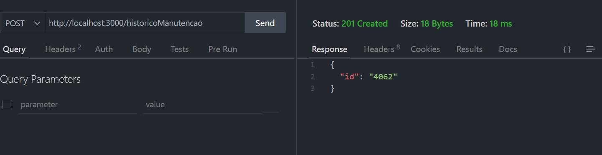

# Sistema de Manutenção Preventiva e Corretiva

## Objetivos

O propósito do Sistema de Manutenção Preventiva e Corretiva é fornecer uma solução eficiente para o gerenciamento de máquinas e equipamentos industriais. Com foco em minimizar o tempo de inatividade e otimizar o desempenho, os principais objetivos do sistema são:

1. **Desenvolver uma interface gráfica (Swing)**: Facilitar o gerenciamento de máquinas, técnicos e manutenções através de uma interface intuitiva.
2. **Implementar funcionalidades CRUD**: Permitir operações de Cadastro, Leitura, Atualização e Exclusão para máquinas, manutenções, falhas e técnicos.
3. **Geração de Relatórios**: Criar relatórios automáticos com base nos dados registrados, incluindo indicadores de desempenho (MTTR e MTBF).
4. **Conexão com API REST**: Armazenar e manipular dados em tempo real através de uma API.
5. **Validação e Testes**: Garantir que o sistema seja robusto e confiável antes da entrega final.
6. **Modelo MVC**: Adotar a arquitetura MVC (Model-View-Controller) para organizar o código e separar a lógica de negócio da interface de usuário, facilitando a manutenção e evolução do sistema.

## Levantamento de Recursos

Para alcançar os objetivos estabelecidos, o projeto vai demandar uma série de recursos técnicos e ferramentas, os quais incluem:

1. **Ferramentas de Desenvolvimento**:
   - **Linguagem de Programação**: Java, para construção do backend e interface gráfica.
   - **Interface Gráfica**: Swing, que permitirá a criação de uma interface amigável para o usuário final.
   - **API REST**: Utilização do JSON-Server para simulação de persistência de dados.
   - **Banco de Dados**: MySQL ou PostgreSQL, caso seja necessária uma persistência de dados mais complexa no futuro.

## Análise de Riscos

| Risco                    | Descrição                                                                                   | Probabilidade  | Impacto   | Mitigação                                                                         |
|--------------------------|---------------------------------------------------------------------------------------------|----------------|-----------|----------------------------------------------------------------------------------|
| **Risco de Prazo**      | Há o risco de não conseguir implementar todas as funcionalidades dentro do prazo estabelecido (uma semana). | Alta           | Alto      | Priorizar o desenvolvimento das funcionalidades essenciais como CRUD e interface gráfica. Deixar melhorias e funcionalidades secundárias para fases futuras. |
| **Risco Técnico**        | A integração com a API REST pode apresentar dificuldades inesperadas, especialmente na manipulação em tempo real dos dados. | Média          | Alto      | Iniciar a implementação da API o quanto antes, usando o JSON-Server para testar a comunicação sem atrasos no cronograma. |
| **Risco de Falta de Testes** | O tempo limitado pode comprometer a execução de testes robustos no sistema, resultando em falhas na versão final. | Média          | Médio     | Realizar testes básicos em cada funcionalidade conforme ela for sendo desenvolvida, garantindo o mínimo de confiabilidade antes da entrega. |

## Diagramas

### Diagrama de Classe

### Diagrama de Fluxo do Operador e Técnico

## Teste ApiRest

### Maquinas - GET

### Maquinas - POST

### Maquinas - PUT

### Maquinas - DELETE

### Manutenções - GET

### Manutenções - POST

### Falhas - GET

### Falhas - POST

### Técnico - GET

### Técnico - POST

### Técnico - DELETE

