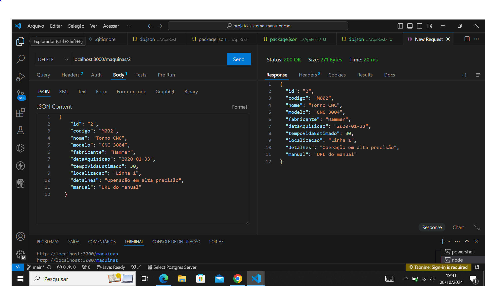

# Sistema de Manutenção Preventiva e Corretiva

## Definição do Tema
O Sistema de Manutenção Preventiva e Corretiva é um software destinado ao gerenciamento do ciclo de vida de máquinas e equipamentos industriais, com foco em minimizar o tempo de inatividade e otimizar a performance operacional. Ele permite o controle das manutenções preventivas (realizadas regularmente para evitar falhas) e corretivas (realizadas após uma falha). O sistema também inclui funcionalidades para registrar falhas, gerenciar técnicos, gerar relatórios e acompanhar indicadores de desempenho, como o MTTR (Mean Time to Repair - Tempo Médio de Reparo) e o MTBF (Mean Time Between Failures - Tempo Médio Entre Falhas).

## Análise de Requisitos e Escopo

### Funcionalidades Principais
- **Gerenciamento de Máquinas e Equipamentos:**
  - Cadastro de máquinas, incluindo especificações técnicas, data de aquisição e localização.
  - Visualização e edição de informações de máquinas.

- **Registro e Controle de Manutenções:**
  - Registro de manutenções preventivas e corretivas.
  - Histórico completo de manutenções para cada máquina.
  - Registro de peças substituídas e tempo de inatividade.

- **Gerenciamento de Falhas:**
  - Registro de falhas ocorridas, classificando a severidade e identificando o operador.
  - Controle de falhas por máquina.

- **Gerenciamento de Técnicos:**
  - Cadastro de técnicos, incluindo suas especialidades e disponibilidade.

- **Relatórios e Indicadores:**
  - Geração de relatórios de manutenção, tempo de inatividade, falhas e peças trocadas.
  - Cálculo de indicadores como MTTR e MTBF.

- **Integração com API:**
  - Utilização de uma API REST (JSON-Server) para armazenar e recuperar dados.

### Requisitos Funcionais
- Cadastro de máquinas com suas especificações.
- Registro de manutenções preventivas e corretivas, associando técnicos e peças trocadas.
- Geração de relatórios de manutenção e indicadores de performance.
- Interface gráfica intuitiva para o usuário final.

### Requisitos Não Funcionais
- Sistema responsivo, com tempo de resposta rápido ao realizar operações com a API.
- Interface amigável e fácil navegação entre funcionalidades.
- Armazenamento e recuperação de dados de maneira segura e eficiente.

## Escopo

### Objetivo
O objetivo do Sistema de Manutenção Preventiva e Corretiva é fornecer uma solução eficiente para o gerenciamento do ciclo de vida de máquinas e equipamentos industriais. O sistema visa minimizar o tempo de inatividade e otimizar a performance operacional por meio das seguintes funcionalidades:

- **Controle Eficiente de Manutenções**: Permitir o registro, monitoramento e agendamento de manutenções preventivas e corretivas, assegurando que todas as intervenções necessárias sejam realizadas em tempo hábil.
- **Geração de Relatórios Abrangentes**: Facilitar a geração de relatórios detalhados sobre as atividades de manutenção, tempo de inatividade e falhas, permitindo uma análise precisa e embasada para a tomada de decisões.
- **Monitoramento de Indicadores de Desempenho**: Proporcionar acompanhamento contínuo de indicadores chave de desempenho, como MTTR (Mean Time to Repair) e MTBF (Mean Time Between Failures), para avaliar a eficácia das operações de manutenção.
- **Registro de Falhas e Gestão de Técnicos**: Garantir que todas as falhas sejam registradas de forma sistemática, além de permitir a gestão eficiente dos técnicos, incluindo suas especialidades e disponibilidade, para alocação adequada em manutenções.

Com essas funcionalidades, o sistema pretende não apenas garantir a continuidade das operações, mas também contribuir para a melhoria contínua dos processos de manutenção nas indústrias.

### Levantamento de Recursos

1. **Tecnológicos**
   - **Linguagem de Programação**: Java.
   - **Banco de Dados**: Uso do Json-Server para simular uma API REST, permitindo armazenamento de dados em formato JSON.
   - **Frameworks**: Spring para desenvolvimento de APIs no backend, bibliotecas de manipulação de JSON (Jackson ou Gson) e ferramentas de geração de relatórios (JasperReports).

2. **Humanos**
   - Desenvolvedores com experiência em Java, Spring e integração com APIs JSON.
   - Especialistas em manutenção para definir parâmetros e estratégias de manutenção.
   - Testadores para garantir o funcionamento correto do sistema.

3. **Materiais**
   - Equipamentos para teste de manutenções.
   - Documentação técnica das máquinas.

## Análise

### 1. Necessidades Operacionais
- **Otimização do Tempo de Inatividade**: A redução do tempo de inatividade é fundamental para evitar falhas e melhorar a eficiência operacional. Os usuários precisam de um sistema que forneça informações em tempo real sobre as manutenções e falhas, permitindo ações rápidas.
- **Facilidade de Acesso aos Dados**: O sistema deve ser intuitivo e permitir que os usuários acessem facilmente dados de manutenção e histórico de reparos. A interface deve ser clara e de fácil navegação, com informações organizadas e acessíveis.

### 2. Desafios de Manutenção
- **Manutenção de Histórico**: É essencial manter um histórico preciso de manutenções e falhas, garantindo que todas as informações sejam registradas e possam ser acessadas para análises futuras.
- **Armazenamento e Acesso Rápido de Dados**: O sistema deve garantir que os dados sejam armazenados e acessados de forma rápida e eficiente pelo Json-Server.

### 3. Análise de Risco
- **Risco de Inatividade de Equipamentos**: Falhas não registradas ou manutenções não realizadas podem resultar em inatividade não planejada. Isso pode afetar a produção e a eficiência operacional.
  - **Mitigação**: Implementar alertas automáticos e lembretes para manutenções programadas e registro de falhas.

- **Risco de Perda de Dados**: A perda de dados devido a falhas no sistema ou problemas de integração com o Json-Server pode comprometer a integridade das informações.
  - **Mitigação**: Realizar backups regulares dos dados e testar a integridade do sistema em intervalos programados.

- **Risco de Usabilidade**: Se a interface do usuário não for intuitiva, pode resultar em resistência à adoção do sistema por parte dos técnicos e operadores.
  - **Mitigação**: Conduzir testes de usabilidade com usuários finais e realizar treinamentos para facilitar a adaptação ao sistema.

- **Risco de Segurança**: A exposição de dados sensíveis relacionados a falhas e manutenções pode levar a problemas de segurança.
  - **Mitigação**: Implementar medidas de segurança, como autenticação de usuários e controle de acesso aos dados sensíveis.

- **Risco de Integração**: Dificuldades na integração entre o sistema e o Json-Server podem atrasar o desenvolvimento e a implementação do sistema.
  - **Mitigação**: Realizar uma análise técnica cuidadosa antes da implementação e garantir que a equipe de desenvolvimento tenha experiência com APIs REST e Json-Server.

